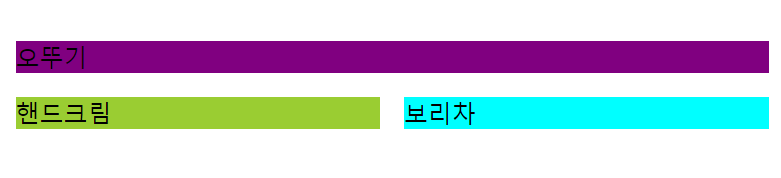
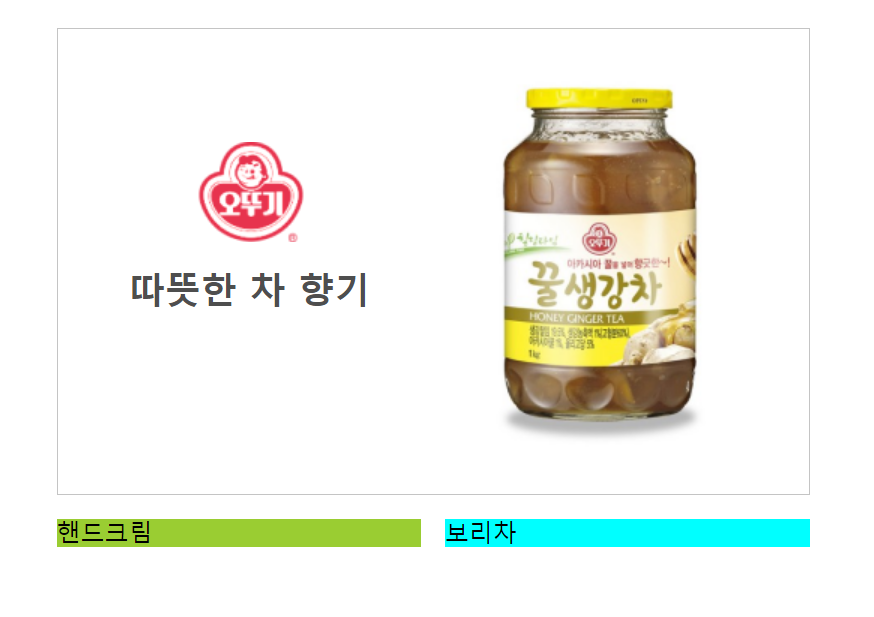
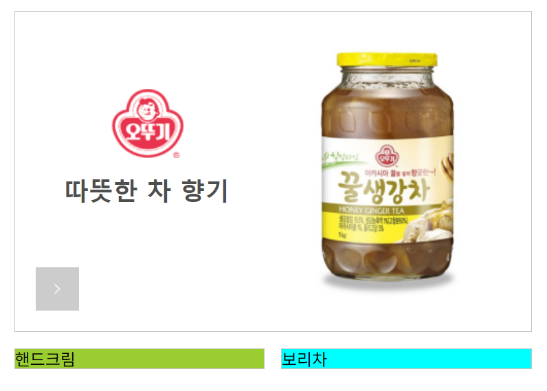
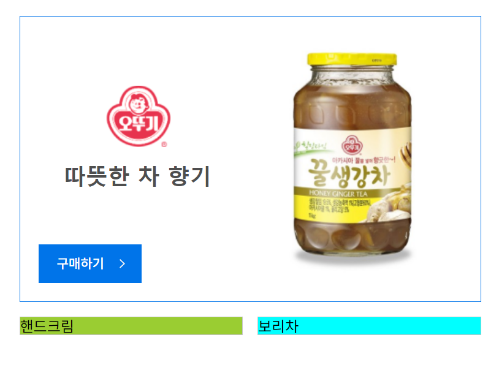
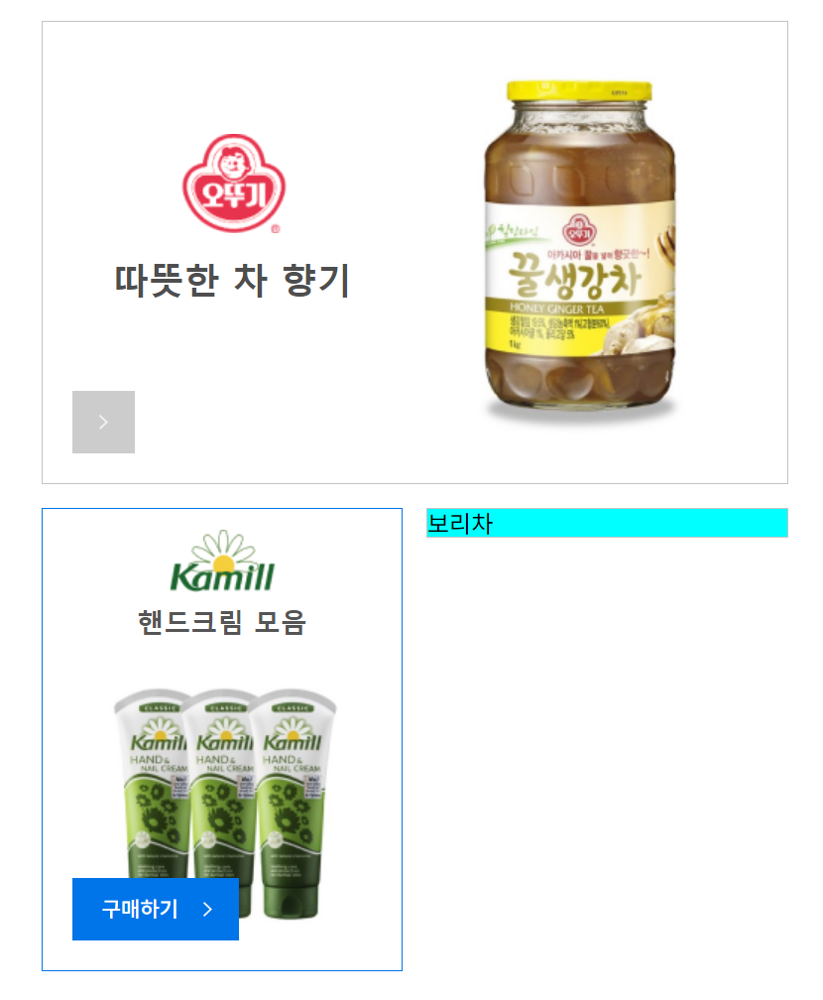
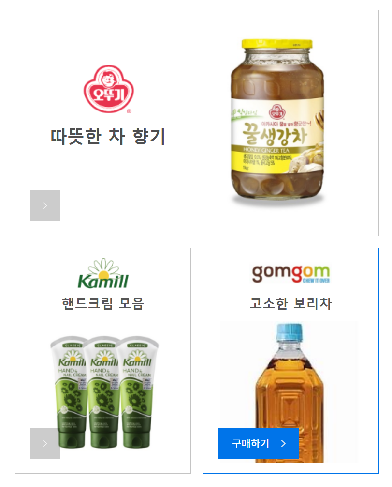
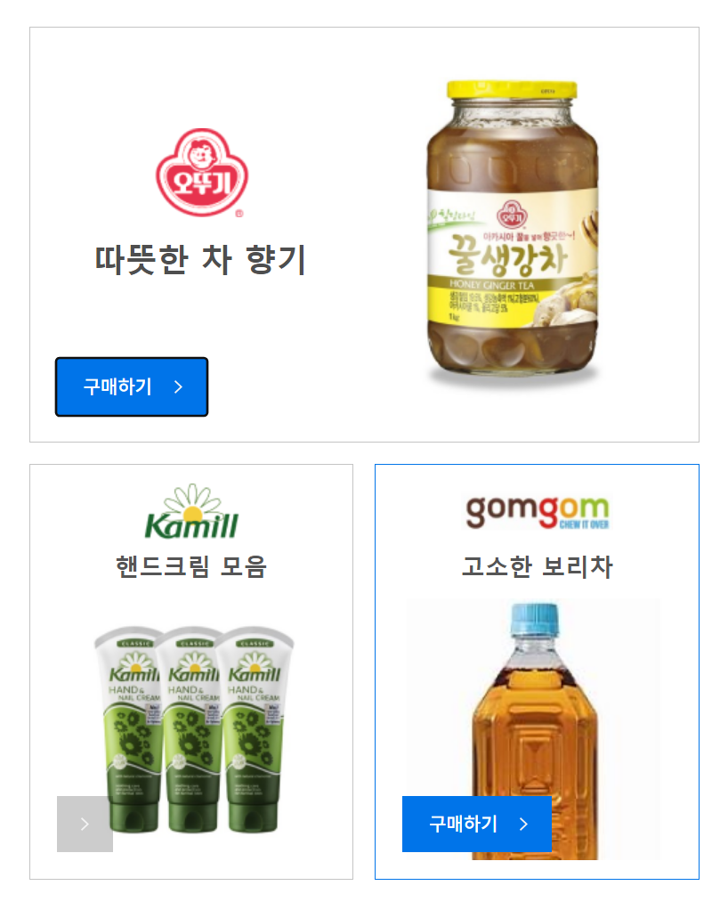

<h1>미션 01 UI 만들기</h1>

## 1. 커밋1 - 준비물 준비
* figma에서 assets 다운로드
* mission-01.html, mission-01.css 생성

## 2. 커밋2 - 레이아웃 생성
* 컨텐츠 레이아웃 생성
> contents 클래스 div를 wrapper로 사용하고 UI의 3개 구성에 따라 각 부분을 **section** 으로 나누기로 결정 
> 상단에는 오뚜기, 하단에는 핸드크림 및 보리차를 float을 사용해 좌 우로 정렬했다.  

## 3. 커밋3 - 오뚜기 섹션 완성
* 오뚜기 UI 섹션 완성
> 로고와 상품이미지는 img 태그로, 설명은 span태그로 결정  
> 상품이미지를 float를 사용해 최우측으로 밀고 margin을 사용해 위치 조절  
> 오뚜기 로고와 상품 설명은 position을 absolute로 지정하여 위치 조절

## 4. 커밋4 - 구매하기 버튼 생성 및 디자인 변경
* 구매하기 버튼 생성 및 hover 시 디자인 변경
> div 태그로 생성해 position을 absolute로 고정  
> figma 시안 스펙 상 모든 컨텐츠 박스에서 위치가 동일해 각 컨텐츠 박스에 구매하기 버튼 클래스 동일 적용  
> background image 속성을 사용해 평상 시 이미지 지정  
> hover 가상 요소를 지정하여 마우스 지정 시 배경 색 변경 밑 화살표 이미지/위치 변경  
> hover::before 가상 요소를 지정하여 구매하기 문구 밑 서식 적용 

## 5. 커밋5 - 핸드크림 섹션 완성
* 핸드크림 UI 섹션 완성
> 오뚜기 섹션과 동일하게 태그 구성  
> 상품이미지를 float을 사용해 좌측으로 밀고 margin으로 위치 조절  
> 카밀 로고와 상품 설명은 오뚜기 섹션과 동일하게 position을 absolute로 지정하여 위치 조절

## 6. 커밋6 - 최종 완성
* 보리차 UI 섹션 완성 및 구매하기 버튼 a태그로 변경  
> 보리차 섹션의 구성 방식은 핸드크림 섹션과 동일하게 적용  
> 접근성을 위해 div로 지정한 구매하기 버튼을 a태그로 변경

## 7. 커밋7 - 진짜 최종
* tab 키를 사용해 구매하기 버튼에 focus되었을 때에도 구매하기 버튼 활성
> focus 가상 요소에 속성 적용

