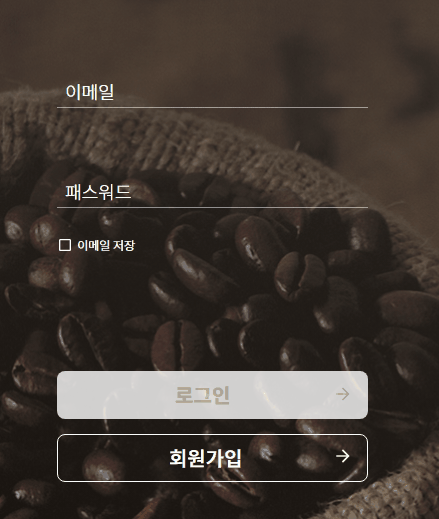
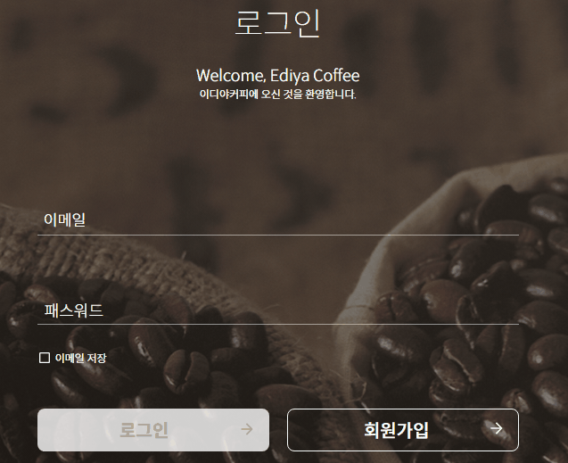

<h1>미션 02 반응형 로그인 페이지 만들기</h1>

## 1. 준비물 준비
* figma에서 assets 다운로드
* mission-02.html, mission-02.css 생성

## 2. 헤더 제작 및 반응형 동작 적용
* 모바일에선 햄버거 메뉴, 데스크탑에선 메뉴 리스트 나열
> 헤더 영역에 이디야 커피 로고 및 메뉴 구성<br />
> ```display: flex``` 를 이용하여 좌우 정렬하고, 뷰포트 크기에 따라 wrapper 크기를 조절하며 양 여백을 조절 <br />
> 추가로 화면의 바탕 이미지를 삽입하였다.


## 3. 모바일 로그인 페이지 반응형 동작 적용
* 모바일 화면 기준 (max-width: 600px)에서 작은 화면이 나오도록 구성
> 로그인 form을 만들어 form 내부에서 디자인 구성<br />
> input 박스는 shadow-box를 이용해 얇은 border를 구성<br />
> shadow-box가 화면 축소 및 확대 시 테두리가 보이는 현상이..<br />
> 자바스크립트 적용 시 로그인 버튼 disable로 적용 예정


## 4. 데스크탑 로그인 페이지 반응형 동작 적용
* 데스크탑 화면 기준 (min-width: 600px)에서 큰 화면이 나오도록 구성
> 이 과정에서 로그인/회원가입 버튼 마크업에 button-wrap div를 추가 <br />
> flex로 버튼 정렬 재구성


## 5. 이메일 / 비밀번호 입력 폼 placeholder 이벤트 적용 및 로그인 버튼 활성/비활성 적용
* 예시 영상과 같이 placeholder 이벤트 적용, 이메일과 비밀번호 입력에 따른 로그인 버튼 활성화
> 기존 input태그에서 placeholer 속성 제거 후 label로 지정 <br />
> label 하위 span태그 생성하여 위치 지정 및 애니메이션 css 추가 <br />
> 포커스 되었을 경우 js로 ```is-focus``` 클래스를 추가하여 디자인 적용하도록 지정 <br />
> 포커스 후 입력된 값이 없다면 다시 placeholder로 돌아오도록 적용
> 이메일 정규식 매치와 비밀번호가 1글자 이상 입력됐을 경우 로그인 버튼 활성화



## 6. 이메일 / 비밀번호 validate 문구 적용
* 이메일 및 비밀번호가 조건에 맞지 않을 경우 경고 문구 표시
> placeholder와 마찬가지로 label > span을 이용하여 is-visible 클래스 제어
> 이메일과 비밀번호가 조건에 모두 맞을 경우 로그인 버튼 활성화하도록 변경

