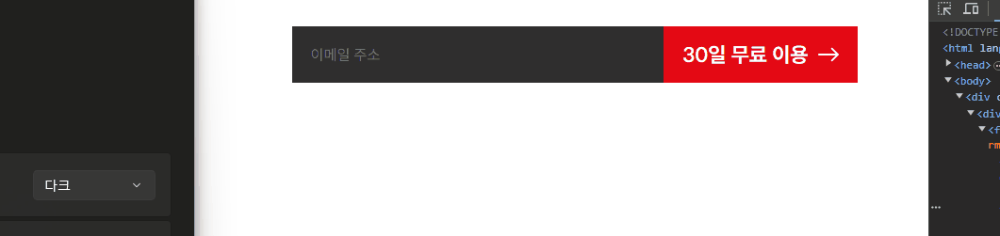

<h1>미션 03 반응형 컴포넌트로 넷플릭스 페이지 만들기</h1>

## 1. 준비물 준비
* figma에서 assets 다운로드
* mission-02.html, mission-02.css 생성
* 컴포넌트 구조 생성

## 2. 컴포넌트 생성
> 1> 원자 요소 생성 (버튼, 로고, 선택 박스)
> * 선택 박스의 경우 div 내부에 selectbox를 배치 후 아이콘을 absolute로 배치하여 포커스 되었을 때 전체 박스가 선택되도록 구현
>
> 2> 분자 요소 생성 (헤더, 폼)
> 
> 3> 조직체 요소 생성 (메인, 푸터)
> * 메인 요소에서 프로모션 안내라는 제목을 스크린 리더에게 제공하도록 h2태그 구성
> * 푸터 구성에 필요한 언어 선택 박스는 푸터 영역에서 추가로 디자인 - 모바일 화면에서도 데스크탑의 선택 박스 디자인 출력
>
><details>
><summary>&nbsp;&nbsp;&nbsp;&nbsp;컴포넌트 링크</summary>
>
>  - [폰트 컴포넌트](https://swlee2973.github.io/home-work/mission-03/components/fonts/)
>  - [로고 컴포넌트](https://swlee2973.github.io/home-work/mission-03/components/logos/)
>  - [버튼 컴포넌트](https://swlee2973.github.io/home-work/mission-03/components/buttons/)
>  - [선택박스 컴포넌트](https://swlee2973.github.io/home-work/mission-03/components/lang/)
>  - [헤더 컴포넌트](https://swlee2973.github.io/home-work/mission-03/components/header/)
>  - [폼 컴포넌트](https://swlee2973.github.io/home-work/mission-03/components/form/)
>  - [메인화면 컴포넌트](https://swlee2973.github.io/home-work/mission-03/components/main/)
>  - [푸터 컴포넌트](https://swlee2973.github.io/home-work/mission-03/components/footer/)
></details>

## 3. 페이지 구성
> 생성한 컴포넌트 조립 <br>
> misson-03.html에 컴포넌트 조립 및 배경 이미지 지정 후 제작 완료

## 4. 페이지 마크업
``` html
<body>
  <header class="header">
    <!-- 기본 로고 -->
    <div class="logo-wrapper">
      <a href="./mission-03.html" class="red-logo">
        
      </a>
    </div>
    <!-- 기본 선택 박스 -->
    <div class="select-wrapper">
      <span class="lang-icon"></span>
      <label for="lang-select" class="sr-only">언어 선택</label>
      <select name="lang-select"
                id="lang-select"
              class="lang-select">
        <optgroup>
          <option value="ko" selected>한국어</option>
          <option value="en">English</option>
        </optgroup>
      </select>
    </div>
    <!-- 로그인 버튼 -->
    <div class="button-wrapper">
      <a href="#" class="button login-button">
        로그인
      </a>
    </div>
  </header>
  <main class="main">
    <h2 class="sr-only">프로모션 안내</h2>
    <div class="main-info">
      <em>영화, TV 프로그램을 무제한으로.</em>
      <p>
        <span>다양한 디바이스에서 시청하세요.</span>
        <span>언제든 해지하실 수 있습니다.</span>
      </p>
      <p>시청할 준비가 되셨나요? 멤버십을 등록하거나 재시작하려면 이메일 주소를 입력하세요.</p>
    </div>
    <div class="form-wrapper">
      <form action="#" class="join-form" method="get">
        <label for="join-email" class="join-email-label">이메일 주소</label>
        <input type="email" name="join-email" id="join-email" class="join-email" 
                oninput="validInput()"
                onfocus="activeEmail()"
                onblur="isEnterInput()" />
        <span class="warn-message">정확한 이메일 주소를 입력하세요.</span>
        <div class="button-wrapper">
          <button type="submit" class="button normal-button">
            30일 무료 이용<span class="right-arrow"></span>
          </button>
        </div>    
      </form>
    </div>
    <p class="limit">신규 회원만 이 프로모션을 이용하실 수 있습니다.</p>
  </main>
  <footer class="footer">
    <em class="footer-info">
      <span>질문이 있으신가요?</span>
      <span>문의 전화: 00-308-321-0058</span>
    </em>

    <div class="link-wrap">
      <ul class="site-link">
        <li><a href="/">자주 묻는 질문</a></li>
        <li><a href="/">고객센터</a></li>
        <li><a href="/">계정</a></li>
        <li><a href="/">미디어 센터</a></li>
        <li><a href="/">투자 정보(IR)</a></li>
        <li><a href="/">입사 정보</a></li>
        <li><a href="/">Netflix 지원 디바이스</a></li>
        <li><a href="/">이용 약관</a></li>
        <li><a href="/">개인정보</a></li>
        <li><a href="/">쿠키 설정</a></li>
        <li><a href="/">회사 정보</a></li>
        <li><a href="/">문의하기</a></li>
        <li><a href="/">속도 테스트</a></li>
        <li><a href="/">법적 고지</a></li>
        <li><a href="/">Netflix 오리지널</a></li>
      </ul>
    </div>


    <div class="footer-lang select-wrapper">
      <span class="lang-icon"></span>
      <label for="lang-select" class="sr-only">언어 선택</label>
      <select name="lang-select"
                id="lang-select"
              class="lang-select">
        <optgroup>
          <option value="ko" selected>한국어</option>
          <option value="en">English</option>
        </optgroup>
      </select>
    </div>
    
    <em class="netflix-ko">Netflix 대한민국</em>

    <div class="address">
      <p>넷플릭스서비시스코리아 유한회사</p>
      <p>통신판매업신고번호: 제2018-서울종로-0426호</p>
      <p>전화번호: 00-308-321-0058</p>
      <p>레지널드 숀 톰프슨</p>
      <p>이메일 주소: korea@netflix-com</p>
      <p>주소: 대한민국 서울특별시 종로구 우정국로 26, 센트로폴리스 A동 20층 우편번호 03161</p>
      <p>사업자 등록번호: 165-87-00119</p>
      <p>클라우드 호스팅: Amazon Web Services Inc.</p>
      <p>공정거래위원회 웹사이트</p>
    </div>

  </footer>
</body>
```

